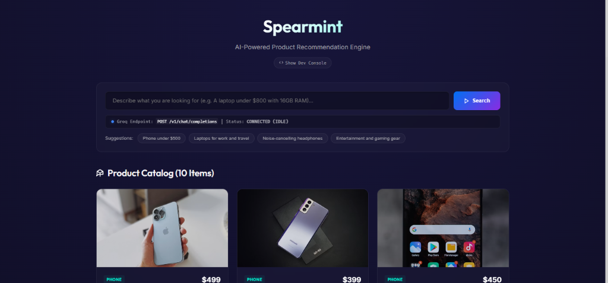
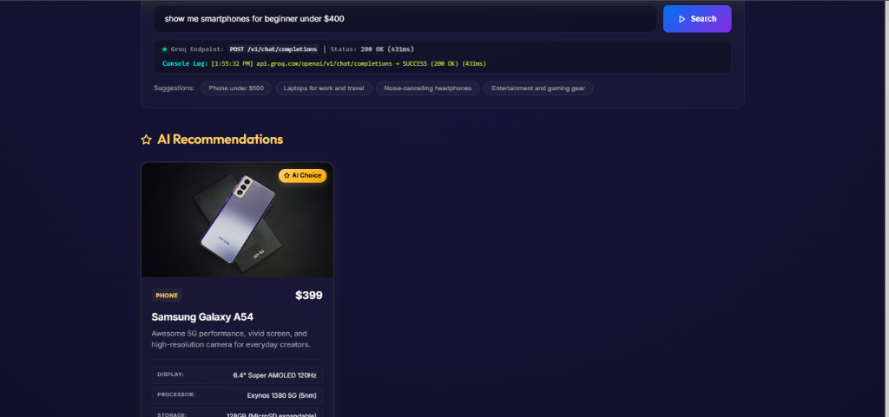
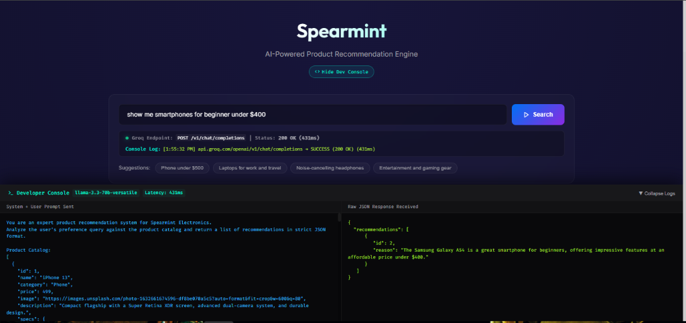

<div align="center">

# 🍃 SPEARMINT

### AI-Powered Product Recommendation Engine — Dynamic E-Commerce Catalog with Real-Time Telemetry

[](https://react.dev/)
[](https://vite.dev/)
[](https://groq.com/)
[](https://vercel.com/)
[](LICENSE)

<br/>

> **SPEARMINT** is a premium e-commerce search and product recommendation platform. Powered by the Groq API running Llama 3.3, it analyzes user queries in real time to recommend products. It features high-resolution product photography, detailed hardware specs, a live connection traffic monitor, and a toggleable developer telemetry console.

<br/>

   

</div>

---

## 📋 Table of Contents

- [Overview](#-overview)
- [Application Preview](#-application-preview)
- [Features](#-features)
- [Architecture](#-architecture)
- [Tech Stack](#-tech-stack)
- [Project Structure](#-project-structure)
- [Installation](#-installation)
- [Usage](#-usage)
- [API Reference](#-api-reference)
- [Configuration](#-configuration)
- [Testing \& Verification](#-testing--verification)
- [Security Notes](#-security-notes)
- [Design Decisions](#-design-decisions)
- [License](#-license)

---

## 🧠 Overview

SPEARMINT bridges the gap between natural language user searches and structured catalog matches. When a customer inputs a preference query (e.g., *"A gaming console under $350 with OLED"* or *"Laptops for travel under $1000"*), the system:

1. Transmits the raw query alongside the entire product catalog payload to Groq's Llama 3.3 endpoint.
2. Evaluates catalog properties using strict system prompt parameters.
3. Retrieves a structural JSON array mapping the recommended item IDs along with detailed matching rationale.
4. Updates the UI with glowing card highlights, responsive specifications badges, and live telemetry log states.

---

## 🖼️ Application Preview

<div align="center">

### 1) Landing Page & Search



<br/>

### 2) AI-Powered Recommendations



<br/>

### 3) Live API Traffic Monitor & Console



</div>

---

## ✨ Features

| Feature | Description |
|---|---|
| 🛍️ **E-Commerce Catalog** | Dynamic catalog of 10 modern consumer electronics containing rich hardware specs |
| ⚡ **Sub-Second Recommendations** | Powered by Groq's low-latency Llama 3.3 versatile inference model |
| 🟢 **Live Traffic Monitor** | Pulse indicator lights that transition through states (`idle`, `transmitting`, `success`, `error`) |
| 📊 **Log Console** | Live HTTP request/response logging capturing precise roundtrip durations |
| 🖥️ **Developer Console Drawer** | Expandable bottoms-up console showcasing raw JSON responses and prompt structures |
| 🎨 **Rich Glassmorphic Design** | Premium UI using dark indigo gradients, subtle borders, and keyframe loading animations |
| 🔎 **Hot Suggestion Tags** | One-tap queries for popular electronics categories and price budgets |
| 📦 **Vercel Deployable** | Production-ready routing structure with SPA redirects |

---

## 🏗️ Architecture

```
┌───────────────────────────────────────────────────────────────────┐
│                        React Interface UI                         │
│                                                                   │
│  Search Bar  ──► Suggestion Tags ──► Product Cards Grid           │
│      │                                    ▲                       │
│      └────── Trigger Recommendations ─────┘                       │
│                         │                                         │
│                         ▼                                         │
│             groq.js (API completions)                             │
└─────────────────────────┬─────────────────────────────────────────┘
                          │
                          ▼ (HTTPS JSON Payload)
┌───────────────────────────────────────────────────────────────────┐
│                        Groq Cloud API                             │
│                                                                   │
│  Inference: llama-3.3-70b-versatile                               │
│  System: strict JSON output constraint mapping IDs & reasoning     │
└───────────────────────────────────────────────────────────────────┘
```

---

## 🛠️ Tech Stack

| Layer | Technology |
|---|---|
| **Core Framework** | React 19, Vite 8 |
| **Styling System** | Custom Vanilla CSS (Outfit & Inter fonts) |
| **AI Integration** | Groq SDK (`groq-sdk`) |
| **Model** | `llama-3.3-70b-versatile` |
| **Hosting Platform** | Vercel (SPA-rewrite routing) |
| **Version Control** | Git & GitHub CLI |

---

## 📁 Project Structure

```
spearmint/
│
├── public/
│   ├── favicon.svg             # Web app icon
│   └── icons.svg               # SVG icons sheet
│
├── src/
│   ├── components/
│   │   └── ProductCard.jsx     # Card component with image & specs
│   │
│   ├── data/
│   │   └── products.js         # Product database with detailed specs
│   │
│   ├── services/
│   │   └── groq.js             # Groq SDK configuration & prompts
│   │
│   ├── App.jsx                 # Core state logic & dev console Drawer
│   ├── index.css               # Main stylesheet and animations
│   └── main.jsx                # React Entry point
│
├── .env                        # Environment key configuration
├── .gitignore                  # Git ignored assets
├── .oxlintrc.json              # Lint configurations
├── index.html                  # HTML template
├── package.json                # Project dependencies
├── README.md                   # System documentation
├── vercel.json                 # Vercel SPA routing redirects
└── vite.config.js              # Vite build setup
```

---

## 🚀 Installation

### 1) Clone
```bash
git clone https://github.com/crastatelvin/spearmint.git
cd spearmint
```

### 2) Install Dependencies
```bash
npm install
```

### 3) Environment Configuration
Create a `.env` file in the root directory:
```env
VITE_GROQ_API_KEY=gsk_your_actual_groq_api_key_here
```

### 4) Start Local Server
```bash
npm run dev
```
Open `http://localhost:5173` in your browser.

---

## 💻 Usage

1. **Ask Spearmint:** Enter a phrase like *"I need a tablet with high storage under $600"* or *"Recommend headphones with great ANC"* in the search box.
2. **Review Recommendations:** View the glowing card deck displaying custom badges, item images, and AI reasoning.
3. **Monitor Traffic:** Watch the pulsing status dot in the search card transition from blue (idle) to orange (transmitting) to green (success).
4. **Inspect Telemetry:** Toggle **"Show Dev Console"** in the header to view the exact prompt sent to the LLM and the raw JSON response received from Groq.

---

## 📡 API Reference

When recommendations are triggered, Spearmint initiates client-side calls directly to the Groq Chat Completions endpoint:

| Endpoint | Method | Payload | Description |
|---|---|---|---|
| `api.groq.com/openai/v1/chat/completions` | `POST` | `{"messages": [...], "model": "llama-3.3-70b-versatile", "response_format": {"type": "json_object"}}` | Fetches JSON-structured recommendations from the Llama model |

---

## ⚙️ Configuration

`.env`:
```bash
# Groq API Credentials
VITE_GROQ_API_KEY=gsk_...
```

`vercel.json`:
```json
{
  "rewrites": [
    { "source": "/(.*)", "destination": "/index.html" }
  ]
}
```

---

## 🧪 Testing & Verification

Ensure compilation integrity and syntax correctness before deployment:

```bash
# Run lint check
npm run lint

# Build production bundle
npm run build
```

---

## 🔒 Security Notes

* **Client-Side Dev Mode:** During development, the Groq client operates client-side utilizing `dangerouslyAllowBrowser: true`. 
* **Secret Management:** The `.env` file containing the `VITE_GROQ_API_KEY` is listed in `.gitignore` and is never pushed to public repositories.
* **Production Deployments:** When deploying to Vercel, it is recommended to set up the `VITE_GROQ_API_KEY` as a secured environment variable under Project Settings.

---

## 🧭 Design Decisions

* **Client-Side API Calls:** Configured the API call within the client application to ensure responsive updates and eliminate intermediate backend latency.
* **JSON Constraints:** Enforced strict system-level instructions using Llama 3.3 in JSON mode to guarantee responses strictly adhere to the expected structured template.
* **SPA Routing:** Configured Vercel rewrites to prevent route mapping errors during page refreshes on hosting environments.

---

## License

This project is licensed under the MIT License. See [LICENSE](./LICENSE).

<div align="center">
Built by Telvin Crasta · Production-ready · Live today

⭐ If Spearmint helped you ship AI recommendations faster, star the repo.
</div>
